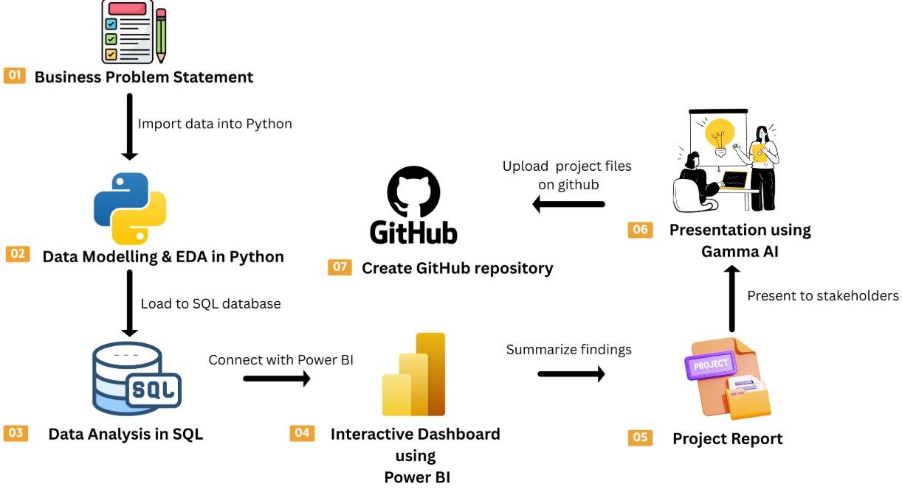

# Customer Shopping Behavior Analysis
This project represents a complete, industry-standard, end-to-end data analytics workflow, designed to mirror the real responsibilities of professional data analysts in modern business environments. It covers all critical stages of data analysis, from data preparation and modeling to insight generation, visualization, and business reporting.

This project is ideal for:
- 📊 Data Analyst aspirants building a strong portfolio project
- 📚 Learners practicing Python, SQL, and Power BI with real-world data
- 💼 Candidates preparing for Data Analytics, Business Analytics, or Product Analytics roles


## 📌 Project Overview
The objective of this project is to simulate a corporate-grade analytics workflow, demonstrating how raw consumer shopping data can be transformed into actionable business intelligence.
Key focus areas include:
✅ Data Preparation, Modeling & EDA (Python)
Clean, preprocess, and explore raw customer data to uncover patterns and trends.

✅ Data Analysis (SQL)
Simulate business transactions and run SQL queries to analyze customer segments, loyalty, repeat purchases, and key purchase drivers.

✅ Visualization & Insights (Power BI)
Build an interactive dashboard to highlight trends across demographics, product categories, discounts, seasons, and sales channels.

✅ Report & Presentation
Summarize insights and business recommendations through a structured report and an executive-level presentation.




## 🛠️ How to Use This Project
1. **Clone the repository**
   ```bash
   git clone https://github.com/JasreenKau/customer_shopping_behavior_analysis.git
   cd customer_shopping_behavior_analysis
   ```
2. **Open Customer_Shopping_Behavior_Analysis.ipynb notebook**
    This file contains:
      - Data Import
      - Data exploration
      - Data cleaning
      - Connection to SQL Database
3. **Load the data from Python notebook into MySQL/PostgreSQL/MS SQL Server**
      - Create a database in SQL
      - Run Python code to load data into SQL database
      - Open **customer_behavior_sql_queries.sql**
      - Answer Business Questions using SQL Queries 
4. **Connect the SQL Database to Power BI**
      - Open **customer_behavior_dashboard.pbix**
      - Create interactive dashboard in Power BI
6. **Create Project Report and Presentation**
      - Create project report
      - Build presentation deck using Gamma AI
7. **Follow along with the YouTube video for full walkthrough. 👨‍💼**


## 📊 Key Insights
- Identification of high-value and loyal customer segments
- Analysis of online vs offline purchasing behavior
- Impact of discounts, seasons, reviews, and payment preferences
- Data-driven recommendations for marketing and product optimization

## 🛠️ Tools & Technologies
- Python (Pandas, NumPy, Matplotlib/Seaborn)
- SQL
- PostgreSQL
- Power BI
- Canva
- GitHub

## 📜 License
MIT License — free to use, fork, and adapt for learning or portfolio purposes.

## 👩‍💻 About the Author
Hi, I’m Jasreen, a Data Analytics enthusiast with a strong interest in analyzing real-world data and translating insights into business impact. I enjoy working with Python, SQL, and BI tools to solve practical problems and build data-driven solutions.

## 💡 Thanks for checking out this project!
If you found this useful, feel free to ⭐ star the repository or share it with someone learning Data Analytics. 🚀
